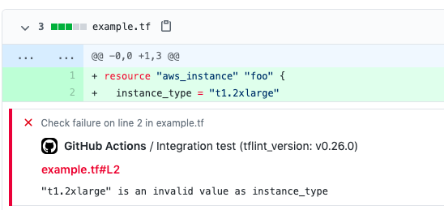

# Setup TFLint Action

A GitHub action that installs a Terraform linter [TFLint](https://github.com/terraform-linters/tflint) executable in the PATH.

## Inputs

All inputs are optional, but may include a default where specified.

### `tflint_version`

The version of TFLint which will be installed. See [TFLint releases page](https://github.com/terraform-linters/tflint/releases) for valid versions.

If version is `"latest"`, the action will get the latest version number using [Octokit](https://octokit.github.io/rest.js/).

Default: `"latest"`

### `checksums`

A newline-delimited list of valid checksums (SHA256 hashes) for the downloaded TFLint binary. When set, the action will verify that the binary matches one of these checksums before proceeding.

This ensures that the downloaded binary for a given version is a known build. If your job runs in multiple operating systems or architectures, include appropriate checksums for all of them.

**Note:** Checksums ensure _immutability_, but do not verify integrity. To prove that checksums come from a known build in TFLint's official repository, use [GitHub’s Artifact Attestations](https://github.com/terraform-linters/tflint?tab=readme-ov-file#github-cli-recommended) or [cosign](https://github.com/terraform-linters/tflint?tab=readme-ov-file#cosign).


### `github_token`

Used to authenticate requests to the GitHub API to obtain release data from the TFLint repository. Authenticating will increase the [API rate limit](https://developer.github.com/v3/#rate-limiting). Any valid token is supported. No permissions are required.

Default: `${{ github.server_url == 'https://github.com' && github.token || '' }}`

GitHub Enterprise Server will make requests to github.com anonymously by default. To authenticate these requests, you must issue a token from github.com and pass it explicitly.

### `tflint_wrapper`

Installs a wrapper script to wrap subsequent calls to `tflint` and expose `stdout`, `stderr`, and `exitcode` outputs.

Default: `"false"`

### `cache`

Enable caching of TFLint plugins. When enabled, the action will cache the plugin directory and restore it on subsequent runs based on the hash of your TFLint configuration file(s).

Default: `"false"`

### `tflint_config_path`

Glob pattern for TFLint configuration file(s) used to generate the cache key. All matching files will be hashed together to determine cache validity. Supports glob patterns for monorepo setups.

Default: `".tflint.hcl"`

### `plugin_dir`

Directory where TFLint plugins are installed. See [TFLint plugin configuration](https://github.com/terraform-linters/tflint/blob/master/docs/user-guide/config.md#plugin-directory) for details.

Can also be set via `TFLINT_PLUGIN_DIR` environment variable.

Default: `"~/.tflint.d/plugins"`

## Outputs

The following outputs are available when the `tflint_wrapper` input is enabled:

- `stdout` - The output (stdout) produced by the tflint command.
- `stderr` - The error output (stderr) produced by the tflint command.
- `exitcode` - The exit code produced by the tflint command.

## Usage

```yaml
name: Lint
on:
  push:
    branches: [ master ]
  pull_request:

jobs:
  tflint:
    runs-on: ${{ matrix.os }}

    strategy:
      matrix:
        os: [ubuntu-latest, macos-latest, windows-latest]

    steps:
    - uses: actions/checkout@v4
      name: Checkout source code

    - uses: terraform-linters/setup-tflint@v6
      name: Setup TFLint
      with:
        tflint_version: v0.52.0
        cache: true

    - name: Show version
      run: tflint --version

    - name: Init TFLint
      run: tflint --init
      env:
        # https://github.com/terraform-linters/tflint/blob/master/docs/user-guide/plugins.md#avoiding-rate-limiting
        GITHUB_TOKEN: ${{ github.token }}

    - name: Run TFLint
      run: tflint -f compact
```

### Latest Release

```yaml
- uses: terraform-linters/setup-tflint@v6
```
or specify it explicitly as
```yaml
- uses: terraform-linters/setup-tflint@v6
  with:
    tflint_version: latest
```

### Using Custom GitHub Token

```yaml
- uses: terraform-linters/setup-tflint@v6
  with:
    github_token: ${{ secrets.MY_CUSTOM_GITHUB_TOKEN }}
```

### Loading Shared Configuration

```yaml
- uses: terraform-linters/setup-tflint@v6
- uses: terraform-linters/tflint-load-config-action@v1
  with:
    source-repo: me/tflint-config
- run: tflint -f compact
```

### Wrapper

```yaml
- uses: terraform-linters/setup-tflint@v6
  with:
    tflint_wrapper: true

- id: tflint
  run: tflint -f compact

- if: always()
  run: echo ${{ steps.tflint.outputs.stdout }}
```

### Plugin Caching

```yaml
- uses: terraform-linters/setup-tflint@v6
  with:
    cache: true

- run: tflint --init
  env:
    GITHUB_TOKEN: ${{ github.token }}

- run: tflint -f compact
```

For monorepos with multiple TFLint configurations:

```yaml
- uses: terraform-linters/setup-tflint@v6
  with:
    cache: true
    tflint_config_path: '**/.tflint.hcl'

- run: tflint --init
  env:
    GITHUB_TOKEN: ${{ github.token }}

- run: tflint -f compact
```

### Checks

This action supports [Problem Matchers](https://github.com/actions/toolkit/blob/main/docs/problem-matchers.md) for `--format compact`. You can see annotations in pull requests when TFLint prints issues with the `compact` format.



## Releasing

To create a new version:

```sh
npm version $inc && git push --follow-tags
```
